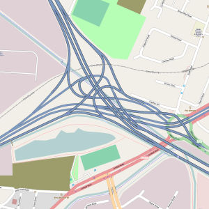

% Spatial Data Formats
% <small>[Shaun Walbridge](http://shaunwalbridge.com) / <a href="https://twitter.com/scw">@scw</a></small>
% <small><a href="https://twitter.com/MaptimeBoston">MaptimeBOS</a> &mdash; 2015-03-18</small>


Download the repo
=================
<h3><a href="https://github.com/scw/maptime-data-formats-2015">https://github.com/scw/maptime-data-formats-2015/</a></h3>

 {data-background="images/halpern-2008.png"}
=

Impacts of Shipping
===================


Job
===

 - Work at <a href="https://www.esri.com">Esri</a> on GIS software for scientific applications
 - Python and R
 - GIS company since 1969, makes things like ArcGIS

I've got plenty of data types, thanks
=====================================

Many existing [data types](https://en.wikipedia.org/wiki/Data_type):

`float` - `int` - `char` - `string` - `timestamp`

. . . 

Can't we just make it with these data types?

Good Ol' CSV, Nothing Beats CSV
===============================

Comma Separated Values

    name, type, latitude, longitude
    BU Bridge, bridge, 42.353, -71.1106
    Prudential Tower, skyscraper, 42.347, -71.082
    'That place where we measured 108.6" of snow', airport, 42.3605, -71.006638

. . .

- A simple tabular structure to store data &mdash; spreadsheet, without the cruft
- Can upload this data to web mapping sites, or use with something like [GDAL](https://www.gdal.org) to convert it to other formats.

GDAL Interlude
==============

GDAL: translate spatial data between formats.

 - OS X: `brew install gdal`
 - Ubuntu/Debian: `apt-get install gdal`
 - Windows: <span style="text-decoration: line-through">You're SOL</span> try [these binaries](http://www.gisinternals.com/release.php) or [OSGeo4W](http://trac.osgeo.org/osgeo4w/).

. . . 

Everyone uses it, you should too!

Convert Our CSV
===============
    
    cd data/
    # ogr2ogr is confusingly <OUTPUT NAME> <INPUT NAME>
    ogr2ogr -f "GeoJSON" locations.geojson locations.csv

 {data-background="images/bad-geojson.png"}
===============

<p style="color: black">
*World's tiniest trumpet* &mdash; doesn't work. Why? GDAL wants to know: Which columns are our spatial data? How are they registered to the surface of the earth?
</p>

Convert Our CSV
===============

```xml
<OGRVRTDataSource>
    <OGRVRTLayer name="locations">
        <SrcDataSource>locations.csv</SrcDataSource>
        <GeometryType>wkbPoint</GeometryType>
        <LayerSRS>WGS84</LayerSRS>
        <GeometryField encoding="PointFromColumns" x="longitude" y="latitude"/>
    </OGRVRTLayer>
</OGRVRTDataSource>
```

. . .

Let's try that again:

    ogr2ogr -f "GeoJSON" locations.geojson locations.csv

[Results](https://github.com/scw/maptime-data-formats-2015/blob/master/data/locations.geojson)

CSV to GeoJSON
==============

Simpler ways:

 - [CSV to GeoJSON](http://togeojson.com/)
 - [GeoJSON.io](https://geojson.io)

So what's all this XML? I thought we were just making a point?

 - GDAL wants to know where to put the data (shh, *projections*)
 - It also knows how to handle higher order data -- data that doesn't fit as well into our simple column model that works fine for points.

Spatial Data Formats
====================

Want data _formats_ that let us store geometric information. We have an attribute model, like the CSV, but want an additional "entity" model to store the geographic information.

 - 0D: Point
 - 1D: Line
 - 2D: Area
 - 3D: Solid
 - 4D: Space-time
 - [With images](images/entity-models.png)

. . .

 - Can't easily cram these into a tabular structure
 - 'Vector' data

Bigger Than Spatial
===================


Source: [Computational Geometry: Algorithms and Applications](http://www.springer.com/computer/theoretical+computer+science/book/978-3-540-77973-5)


Simple Features Model
=====================

 - [An OGC specification](https://en.wikipedia.org/wiki/Simple_Features) for representing geometries
 - Geometries bring their own edge cases:

    + WKT Example: `POLYGON((0 0, 10 10, 0 10, 10 0, 0 0))`


Shapefile
=========

 - Open specification, 1996 ([Whitepaper](http://www.esri.com/library/whitepapers/pdfs/shapefile.pdf), [Wikipedia](http://en.wikipedia.org/wiki/Shapefile))
 - Historically the langua-franca for exchanging vector data
 - A collection of sidecar files (`.shp, .shx, .dbf`) plus some optional extras (`.prj`, `.sbn`, ...)
 - Stores attribues in a DBF file, entity data in two parts:
    * `.shp` contains the shapes themselves (in binary)
    * `.shx` contains the index to look up shape locations in the `.shp`

Shapefile
=========
 - Pros: 
    + fast, ubiquitous, file-based means easy streaming, includes an index (usually quadtree) for fast lookup
 - Cons:
    + Record offset is a `16-bit int`, so only 2GB files
    + Only one *spatial type* per file
    + The attribute model

 - Remember: attribute model (our table) + entity data (the shapes) 
 - Attributes are '[dBase](http://en.wikipedia.org/wiki/DBase)': the cutting edge format of 1988.
    * limited column names
    * spreadsheet software hates it

Shapefile
=========

    # default output of OGR is a shapefile, no `-f format` needed
    ogr2ogr locations.shp locations.vrt

 - Knows about this 'projection' thing
 - A variety of other traits that makes it great as a data storage format
 - But it's domain specific, so no broader ecosystem

 {data-background="images/shapefile.png"}
=

GeoJSON
=======

 - A community driven effort to create an agnostic JSON specification which can easily encode geometries (again, our attribute + entity model).
 - [http://geojson.org](http://geojson.org)
 - Spec created in 2008, but really has taken off in the past 3 years -- confluence of awesome.
 - [Submitted to IETF](http://www.ietf.org/id/draft-butler-geojson-05.txt)
 - `JSON` has a massive ecosystem! Spatial is always better when it bootstraps the existing technology ecosystem

GeoJSON
=======

 - Our same entity + attribute model, but now with JSON!

```json
{
"type": "FeatureCollection",
"crs": { "type": "name", "properties": { "name": "urn:ogc:def:crs:OGC:1.3:CRS84" } },
                                                                                
"features": [
{ "type": "Feature", "properties": { "name": "BU Bridge", "type": "bridge", "latitude": "42.353", "longitude": "-71.1106" }, "geometry": { "type": "Point", "coordinates": [ -71.1106, 42.353 ] } },
{ "type": "Feature", "properties": { "name": "Prudential Tower", "type": "skyscraper", "latitude": "42.347", "longitude": "-71.082" }, "geometry": { "type": "Point", "coordinates": [ -71.082, 42.347 ] } },
{ "type": "Feature", "properties": { "name": "That place where we measured 109in of snow", "type": "airport", "latitude": "42.3605", "longitude": "-71.006638" }, "geometry": { "type": "Point", "coordinates": [ -71.006638, 42.3605 ] } }
]
}
```

Non-Planar Datasets
===================

 - Shapefiles & GeoJSON are non-planar formats, a.k.a. spaghetti:



[Wikipedia; GDFL](http://commons.wikimedia.org/wiki/File:OSM_knooppunt_Birmingham_-_spaghetti_junction.png)

- What you want in 98% of cases, but when you don't...

 
Topological Datasets
====================

 - What's a topological dataset?
 - [GIS.SE answer](http://gis.stackexchange.com/questions/178/simplifying-adjacent-polygons)
 - Support in GRASS, PostGIS, ArcGIS (`E00`, parcel fabric) and now, with TopoJSON

TopoJSON
========

 - Last Maptime, Andy gave us a great demo of D3 &mdash; [TopoJSON](https://en.wikipedia.org/wiki/GeoJSON#TopoJSON) also created by [Mike Bostock](http://bost.ocks.org/mike/) (plus our very own [Calvin Metcalf](http://calvinmetcalf.com/))
 - I'm hoping Calvin is here to represent
 - [The Spec](https://github.com/topojson/topojson-specification/blob/master/README.md)

TopoJSON
========

 - Supports transforms and quantization
 - Primarily intended as a *data visualization* format -- throws out data where it doesn't help make a good image at the scale of a D3 canvas.

Files are no fun, what about databases?
=======================================

[PostGIS](http://postgis.net/), [GeoPackage](http://www.geopackage.org/) (SQLite), [SQL Server](https://msdn.microsoft.com/en-us/library/bb933790.aspx), [Esri Geodatabase](http://www.esri.com/products/arcgis-capabilities/data-management), ...
 
- Everyone can take advantage of spatial data, so its becoming
  a primative type in most database engines
- Some engines (e.g. PostGIS, GDB) on more of the problem space

Attributes + Entities == Magic!
===============================

Neat example
============

This stuff + computational geometry:

[Wherewolf](https://source.opennews.org/en-US/articles/introducing-wherewolf/)

Koop: Expose Open Data as GeoJSON and Feature Services:

[https://github.com/Esri/koop](https://github.com/Esri/koop)

Thanks
======

 - Maptime Boston
 - CartoDB for the pizza
 - Esri for paying me to nerd out on geospatial

BONUS FORMAT: GeoJakeSON
========================


